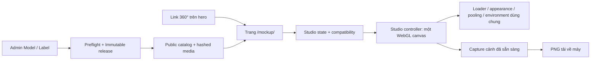

# MASTER PLAN — VINUT 3D Mockup Studio

**Ngày:** 06/10/2026 · **Phiên bản:** 1.2 — cập nhật bố cục 3:4 theo yêu cầu  
**Trạng thái:** Đã triển khai MVP; production build local và static GitHub Pages đều đạt. QA browser xác nhận entry/deep link/refresh, responsive/RTL, cache có giới hạn và PNG thật trắng/gradient/trong suốt ở cả ba tỷ lệ. Native download trên Chrome/Edge và benchmark thiết bị vật lý còn cần xác nhận.  
**Điểm mở:** Ô **360° / Explore freely** trên giao diện chính.  
**Route đã triển khai:** `/mockup/`; đường dẫn có base path GitHub Pages là `/HyperDrink/mockup/`.  
**Hướng dẫn và bàn giao:** [MOCKUP_STUDIO.md](MOCKUP_STUDIO.md).

Tài liệu giữ lại mục tiêu và quyết định thiết kế của master plan, đồng thời cập nhật cấu trúc thực tế và trạng thái acceptance. Mã nguồn đã thay đổi chức năng website; dữ liệu catalog thật chưa được publish/import và website chưa được triển khai công khai trong công việc này. Các ô chưa đánh dấu ở mục 12 cần bằng chứng trình duyệt hoặc thiết bị thực, không đồng nghĩa chức năng chưa có mã nguồn.

## 1. Mục tiêu và phạm vi bản đầu

Tạo một không gian mockup để người xem chọn bao bì 3D, ghép nhãn tương thích, điều chỉnh góc nhìn, nền và chuyển động, rồi tải ảnh thành phẩm về máy. Tận dụng renderer, thư viện tài nguyên và quy trình phát hành hiện có; không xây lại website.

| Bắt buộc trong bản đầu | Để sau khi chức năng chính ổn định |
| --- | --- |
| Model lớn đứng thẳng, canvas bên trái | Upload nhãn/file GLB riêng từ máy |
| Thư viện model, preset Display 3D và nhãn bên phải | Chỉnh UV, kéo/căn nhãn thủ công |
| Lọc model theo bao bì/dung tích; lọc nhãn theo loại nước | Trình chỉnh ánh sáng đầy đủ |
| Ghép nhãn đúng bao bì và UV | Thêm trái cây, lá, splash, ice vào cảnh |
| Góc camera có sẵn, kéo để xoay góc nhìn, zoom, đặt lại | Nhiều sản phẩm trong một cảnh |
| Nền trắng, xám, tối, màu/gradient và trong suốt | Video/GIF, xuất hàng loạt, ảnh 8K |
| Xoay sản phẩm hoặc camera quay quanh sản phẩm | Lưu dự án, chia sẻ cấu hình, tài khoản người dùng |
| Capture và tải PNG, giữ đúng góc/nền hiện tại | Thuộc tính vật liệu nâng cao |
| Responsive, bàn phím, trạng thái tải/lỗi rõ ràng | Dịch vụ cloud/render trả phí |

**Diễn giải bố cục:** Yêu cầu số 2 đặt mô hình bên trái, công cụ bên phải; kế hoạch dùng bố cục này. Thư viện được nhắc ở số 4 nằm trong khu vực công cụ bên phải để không chiếm canvas.

## 2. Kết quả audit và trạng thái sau triển khai

| Thành phần | Phần dùng lại | Phần đã triển khai |
| --- | --- | --- |
| `ShowcaseHero.tsx` | Ô 360°, dữ liệu sản phẩm đang chọn | Link thật tới `/mockup/`, chuyển Display 3D hợp lệ bằng ID |
| `ProductViewer.tsx`, `lib/viewer/runtime.ts` | Quy tắc tải GLB, lighting, normalization và xử lý tài nguyên | Controller riêng `lib/mockup/runtime.ts` có camera, motion và capture; không dùng choreography hero |
| `appearance.ts`, `pooled-appearance.ts` | Ghép nhãn, sampler/UV, chuẩn bị texture/material, quản lý sở hữu tài nguyên | Selector model/nhãn và blank surface riêng cho Studio |
| `resource-prefetch.ts`, `environment.ts` | Cache file nén, hủy tải, HDRI/procedural environment | Cache, render loop, cancellation và dispose có giới hạn riêng cho Studio |
| Catalog + xuất bản + static export | Model, label, packaging, immutable release, media có hash | Trường admin, explicit Mockup roots, preflight và cùng immutable release |

Số liệu audit trước triển khai: **bản public có 2 model, 19 label, 19 Display 3D**; bản nháp có **6 model sẵn sàng, 28 label, 28 Display 3D đang bật**. Việc triển khai không tự mở rộng bản public; đây không phải giới hạn chức năng.

Bốn model 180 ml, 250 ml short, 250 ml sleek và 500 ml trong bản nháp chưa có nhãn tương thích và chưa có poster. Cần chuẩn bị poster/thumbnail trước khi đưa vào thư viện công khai; model không có nhãn vẫn có thể dùng để xem bao bì trống.

**Hai vấn đề kiến trúc đã được giải quyết trong mã nguồn:**

1. Runtime hero đặt lại vị trí camera và có chuyển động tự quay/tự trở về. Studio dùng controller riêng cùng OrbitControls, giữ các module appearance/environment dùng chung.
2. Public catalog hợp nhất graph bán hàng và roots Mockup được bật rõ ràng. “Tất cả model” chỉ gồm model được selector cho phép; bản nháp không tạo quyền public.

## 3. Hướng trải nghiệm và thiết kế

### 3.1. Bố cục desktop

| Preview bên trái — 3 phần | Khu chỉnh sửa bên phải — 4 phần |
| --- | --- |
| Model đứng thẳng, khung ảnh đúng tỷ lệ | Thư viện: Models / Presets / Labels, tìm kiếm và bộ lọc |
| Zoom / đặt lại góc nhìn | Cột công cụ: nền, màu gradient, 6 góc camera, motion, Play/Pause, speed |
| Tên model/nhãn và trạng thái | Khung ảnh / độ phân giải / nút tải PNG luôn hiện |
| Thumbnail PNG vừa xuất / tải lại | 4 thẻ mỗi trang, phân trang luôn hiện |

- Theo yêu cầu refactor, preview trái và khu chỉnh sửa phải dùng tỷ lệ **3:4** trên desktop từ 1200 px. Khu phải chia tiếp thành thư viện và cột công cụ.
- Nền, camera, motion và export cùng hiện trong viewport; chiều cao canvas tự co theo khung ảnh. Màn hình thấp thu gọn giới thiệu và thẻ thư viện để giữ nút chỉnh sửa/xuất ảnh luôn thấy được.
- Một vùng thư viện cuộn riêng, không tạo nhiều lớp scrollbar lồng nhau. Có thể đổi model/nhãn và nhìn kết quả cùng lúc.
- Chrome giao diện sáng, gọn, dùng màu xanh VINUT và typography sẵn có. Màu nền canvas thay đổi độc lập; chữ và toolbar luôn giữ độ tương phản.
- Dùng Lucide/SVG hiện có, tên chức năng rõ ràng, trạng thái chọn có cả đường viền và dấu chọn. Không thêm font hoặc thư viện animation chỉ để trang trí.
- Chữ phụ giữ khoảng cách chữ mặc định, theo yêu cầu đã thống nhất cho website.

**Tham khảo UI UX Pro Max:** Kết quả tra cứu chưa cung cấp bố cục editor phù hợp hoàn toàn; kế hoạch dùng các quy tắc mặc định của skill về tương phản, focus, thao tác chạm, phản hồi tải và responsive, kết hợp hệ thiết kế VINUT hiện có. Không áp dụng mẫu landing page/storytelling trả về từ tra cứu.

### 3.2. Tablet, mobile và khả năng truy cập

- Tablet: canvas ở trên hoặc cạnh panel thu gọn, tùy chiều rộng thực tế. Mobile: canvas trước, panel tab ở dưới; các thanh công cụ thành hàng nút gọn, không phủ lên phần quan trọng của sản phẩm.
- Không cố ép ba thanh dọc desktop vào màn hình điện thoại. Thử tối thiểu 375, 390, 768, 1024 và 1440 px, cả xoay ngang.
- Nút chạm tối thiểu 44 × 44 px; toolbar có tên/tooltip và focus rõ. Người dùng bàn phím có thể chọn preset và zoom mà không cần kéo chuột.
- Canvas không chiếm thao tác cuộn của cả trang. Pinch/drag trong vùng điều khiển có hướng dẫn, giữ khả năng phóng to trang.
- Mọi animation mặc định tắt. Tôn trọng reduced motion; người dùng chủ động bấm Play mới chạy animation.
- Dùng hệ i18n/RTL hiện có cho toàn bộ text chức năng mới. Tên/description từ catalog đi qua cơ chế dịch data đã có, không thêm dịch vụ trả phí.

## 4. Luồng sử dụng chính

1. Người dùng bấm ô **360°** trên trang chính → mở trang Mockup trong cùng tab.
2. Nếu Display 3D hiện tại hợp lệ và cả model lẫn label được phép dùng trong Mockup, mở đúng bộ đang xem. Mở trực tiếp `/mockup/` thì chọn preset được phép dùng đầu tiên; nếu không có preset, chọn model được phép dùng đầu tiên. Nếu tài nguyên bị admin ẩn riêng khỏi Mockup, báo rõ và chọn cấu hình mặc định hợp lệ, không vượt qua thiết lập ẩn.
3. Người dùng chọn model khác → thư viện nhãn cập nhật theo bao bì/UV → lọc loại nước và chọn nhãn.
4. Chọn góc camera, chỉnh nền, thử một kiểu animation nếu muốn.
5. Chọn khung ảnh và độ phân giải → **Tải ảnh PNG**.
6. Studio chụp đúng trạng thái đã sẵn sàng, tải file xuống, rồi trả preview về trạng thái trước capture.

Deep link chỉ chứa ID catalog, ví dụ `/mockup/?display=<id>` hoặc `?model=<id>&label=<id>`. ID phải kiểm tra với bản phát hành hiện tại và selector quyền hiển thị Mockup. Không nhận đường dẫn GLB/ảnh tùy ý từ URL. ID cũ, bị ẩn hoặc không tương thích phải có thông báo và phương án chọn lại.

Ô 360° được đổi thành link điều hướng thật, có thể dùng bàn phím. Khi trang chính ở chế độ 2D, vẫn có thể mở Studio nhưng chỉ chuyển các ID 3D hợp lệ; không đưa ảnh 2D vào bộ tải GLB.

## 5. Thư viện, bộ lọc và quy tắc ghép nhãn

### 5.1. Ba tab thư viện

| Tab | Nội dung | Bộ lọc/hành vi |
| --- | --- | --- |
| **Mô hình** | Toàn bộ model được phát hành cho Mockup | Loại bao bì, dung tích, tìm tên; phân biệt 250 ml short và sleek |
| **Preset 3D** | Display 3D public có cả model và label được phép dùng trong Mockup | Loại nước, dung tích, tìm tên; bấm để nạp cả bộ |
| **Nhãn** | Label tương thích model hiện tại | Loại nước, tìm tên/hương vị; nhóm theo loại nước và có số lượng |

Tất cả thẻ thư viện dùng poster/thumbnail **2D lazy load**. “All” là tất cả bản ghi có thể chọn, không phải tải tất cả GLB/texture lên GPU. Danh sách dài dùng phân trang hoặc virtualization; chỉ nạp model khi chọn.

### 5.2. Compatibility bắt buộc

Một label chỉ được áp dụng khi:

- Model và label còn active; GLB/ảnh nhãn đúng loại media và ở trạng thái ready.
- `label.compatibilities` có đúng **`packagingVariantId` của model**.
- `layoutProfile` không rỗng và khớp model.
- Model có material slot nhận nhãn hợp lệ, đã kiểm tra với GLB thực tế.

**Dung tích chỉ là bộ lọc, không phải điều kiện đủ.** Model 250 ml short và 250 ml sleek không được dùng chung nhãn nếu khác packaging/UV.

Helper dùng chung `checkModelLabelCompatibility()` đã có trong `lib/catalog/compatibility.ts`. Validation Display 3D bán hàng vẫn kiểm tra thêm dòng sản phẩm, loại nước và flavor. Mockup cho phép chọn bất kỳ label tương thích bao bì/UV; flavor/loại nước lấy từ label, không tạo SKU giả trong database.

Khi đổi model, chỉ giữ label cũ nếu còn tương thích; nếu không thì chuyển về bao bì trống và hướng dẫn chọn nhãn. Khi chọn preset, nạp đúng cặp model + label của preset. Khi đổi label tự do, bỏ trạng thái preset đã chọn nếu không còn khớp.

### 5.3. Trạng thái cần thiết

- Chưa có nhãn phù hợp: **“Chưa có nhãn tương thích với bao bì này”**, vẫn cho xem/chụp model trống nếu vật liệu gốc hỗ trợ.
- Bao bì trống: `lib/mockup/appearance.ts` gỡ artwork base-color nhúng trên slot nhãn, giữ thuộc tính PBR và quản lý texture bị tách. Unit test xác nhận placeholder này; chất lượng hình ảnh của từng GLB mới vẫn cần kiểm tra trước khi phát hành.
- Bộ lọc không có kết quả: hiển thị nút xóa bộ lọc, không nhầm với lỗi tải.
- Đang đổi model/label: giữ preview hợp lệ gần nhất, thể hiện đang tải; khóa capture đến khi lựa chọn mới commit.
- Tải lỗi: cho thử lại; không âm thầm ghép nhãn khác hoặc capture cảnh cũ dưới tên lựa chọn mới.

## 6. Dữ liệu admin và phát hành

### 6.1. Trường đã triển khai

Không cần tạo một bộ model/label thứ hai. Bổ sung vào `Model3D` và `Label` hiện có:

| Trường | Ý nghĩa |
| --- | --- |
| `mockupVisible?: boolean` | Admin bật/tắt tài nguyên trong thư viện Mockup |
| `mockupPosition?: number` | Thứ tự thẻ trong thư viện |
| `mockupFrontYaw?: number` trên model | Góc hiệu chỉnh mặt trước dành riêng cho Studio, đơn vị radian; không sửa orientation của hero |

Admin Model 3D và Label có checkbox **“Hiển thị trong Mockup 3D”**, thứ tự, helper text và nút quay về quy tắc mặc định của Display bán hàng. Model có trường góc mặt trước trong thiết lập kỹ thuật. Bản ghi mới mặc định `mockupVisible: false`; không tự public mọi file vừa upload.

Quy ước tương thích dữ liệu cũ:

- `true`: tài nguyên là một gốc được phát hành cho Mockup, kể cả không dùng trên hero/Best seller.
- `false`: ẩn khỏi Mockup; vẫn dùng được trong Display 3D bán hàng nếu cấu hình bán hàng hợp lệ.
- Không có trường: những model/label được Display 3D bán hàng public sử dụng tạo thành thư viện mặc định an toàn cho release cũ. Không suy ra quyền hiển thị từ việc bản ghi tồn tại trong bản nháp.

Thư viện, preset, context từ hero và query ID đều qua **cùng một selector**. Fallback cho trường vắng mặt chỉ dùng các ID có thể truy tới từ Display 3D bán hàng public, không dùng toàn bộ model/label có mặt trong catalog mở rộng. Preset có model hoặc label bị ẩn không xuất hiện trong Studio; deep link cũng không được bỏ qua quy tắc này.

### 6.2. Mở rộng public catalog

`collectPublicCatalog()` hợp nhất hai nguồn: graph sản phẩm đang phát hành và model/label được bật riêng cho Mockup. Thu thập đủ media, poster, packaging/category, drink type và flavor liên quan. Không kéo toàn bộ flavor pool, product detail, dữ liệu tài khoản hay media nháp chỉ vì một model được bật cho Mockup.

Preflight kiểm tra các tài nguyên Mockup mới, kể cả tài nguyên không nằm trong Display bán hàng: metadata, checksum/file thực tế, material slot, UV profile, lifecycle và trạng thái media. `lib/server/media/model-slots.ts` kiểm tra binding nhãn trong scene GLB thật, UV `TEXCOORD_0` có dữ liệu và vật liệu PBR hỗ trợ artwork. Thumbnail dùng poster model hoặc ảnh artwork 2D có sẵn, không render hàng loạt GLB trong trình duyệt khách.

Thư viện nằm trong **cùng immutable release** với storefront; rollback phục hồi cả hai. Giới hạn lịch sử 10 bản giữ nguyên. Xóa tài nguyên khỏi bản nháp không sửa nội dung release cũ; kiểm tra tham chiếu trước khi xóa.

MVP không bổ sung cơ chế dọn media. Giữ retention hiện tại: `retained_public_media` và các file static có hash còn phục vụ trang cũ đã mở, kể cả sau khi xóa một release. Nếu làm garbage collection sau này, phải xét cả dữ liệu retained và phiên/release còn được cache hoặc ghim, không chỉ quan hệ tham chiếu trong draft và lịch sử còn lại.

Studio ghim một release qua `components/mockup/useMockupCatalog.ts`. Dùng loader public hiện có; kiểm tra release mới mỗi 60 giây khi tab hiện và chỉ cho người dùng chủ động nạp lại. Probe không đổi model/label trong cảnh đang chỉnh và xóa thông báo cũ nếu release active được rollback về bản đang ghim.

### 6.3. Local và GitHub Pages

- Public Studio chỉ đọc nguồn catalog đã phát hành; không gọi API quản trị và không cần đăng nhập.
- Route là static Next page; dùng `publicUrl()` và media resolver hiện có để xử lý `/HyperDrink`, trailing slash và đường dẫn có hash.
- Static export bao gồm mọi media được thư viện Mockup tham chiếu, ngay cả model không xuất hiện trên trang chính.
- Phát hành ở admin local không tự cập nhật GitHub Pages. Phải export snapshot/media, build rồi deploy theo quy trình hiện tại.
- Giai đoạn này chưa publish, push Git hoặc triển khai bất kỳ thay đổi dữ liệu nào.

## 7. Kiến trúc kỹ thuật đã triển khai



### 7.1. Controller riêng, dùng lại phần chung

`lib/mockup/runtime.ts` có camera và animation độc lập, dùng Three.js loaders cùng appearance pool, prefetch, environment và disposal hiện có. `lib/catalog/resolve.ts` tách mapping model/label dùng chung cho Display và Studio.

API chính:

```ts
select(asset, appearance, frontYaw?)
setCamera(preset)
setBackground(background)
setAnimation({ mode: 'off' | 'turntable' | 'camera-orbit', speed, playing })
setAspect(width / height)
orbitView(yawRadians, pitchRadians)
zoom(factor)
resetView()
capture(options): Promise<Blob>
dispose()
```

React quản lý ID lựa chọn, bộ lọc và state UI. Three.js giữ scene, camera, controls, material và texture trong controller. Thao tác kéo/animation mỗi frame không cập nhật React state liên tục.

Scene mặc định: một model đứng thẳng, studio light, không có fruit/leaf/splash/ice và không có choreography xuất hiện/thoát của hero. `ProductAsset.orientation` vẫn hiệu chỉnh hệ trục nguồn; transform trình bày của Studio không nghiêng lon.

### 7.2. Camera và chuyển động

| Công cụ | Quy tắc |
| --- | --- |
| Chính diện, sau, trái, phải, góc 3/4, trên chéo | Preset nhìn về tâm model; chính diện phải kiểm tra mặt nhãn thực tế |
| Kéo và zoom | Camera đổi góc quanh model; model vẫn đứng thẳng; giới hạn zoom để tránh lọt vào geometry |
| Fit / đặt lại | Camera fit theo bounds và aspect hiện tại, chừa khoảng thở; không reset model/label/nền |
| Đứng yên | Render khi có thay đổi, không chạy animation nền liên tục |
| Xoay lon | Chỉ model quay quanh trục Y; camera giữ nguyên |
| Camera orbit | Camera quay từ chính góc hiện tại, giữ cao độ/khoảng cách và nhìn về tâm model |
| Play/Pause và tốc độ | Một kiểu animation tại một thời điểm; tốc độ độc lập FPS |

Chọn preset hoặc kéo camera sẽ pause animation để thao tác không bị chống lại. Không tự trở về góc cũ sau khi buông chuột. Bản đầu dùng **trên chéo**, tránh góc thẳng từ cực gây singularity/up-vector khó đoán.

Framing Studio phải hỗ trợ hướng nhìn bất kỳ, aspect dọc và các hình bao bì khác nhau. Không dùng nguyên phép fit +Z và vùng dự phòng animation hero.

### 7.3. Tính nhất quán khi tải nhanh

State tối thiểu: `loading-model → loading-label → preparing → ready`, thêm `exporting` và `error`. Model trống có thể bỏ qua bước label.

- Mỗi lựa chọn có revision/request token và `selectionKey` gồm model, appearance và front yaw; kết quả tải cũ không được đè lựa chọn mới. Chọn lại cùng cảnh re-emit ready, không gây loading vô hạn.
- `ready` chỉ có sau geometry, nhãn bắt buộc, environment, nền, upload texture và shader preparation của đúng revision.
- Capture chỉ nhận snapshot đã commit. Tại thời điểm bắt đầu xuất, khóa đổi cảnh cho đến khi snapshot hoàn tất hoặc bị hủy; navigation/query và yêu cầu select mới được giữ lại để áp dụng sau khi gate được mở.
- Có timeout/thử lại cho nguồn lỗi; giữ khả năng quay lại website nếu WebGL2 không khả dụng hoặc context bị mất.

## 8. Capture và tải ảnh — pipeline đã triển khai

### 8.1. Hành vi sản phẩm

- PNG là định dạng bản đầu, hỗ trợ nền trong suốt.
- Khung: vuông 1:1, dọc 4:5, ngang 16:9. Preview có frame đúng tỷ lệ xuất; không cắt bất ngờ khi tải ảnh.
- Độ phân giải theo cạnh dài: **1024 px** và **2048 px**. Mobile mặc định 1024, desktop 2048; giảm theo giới hạn thiết bị nếu cần. Chưa có 8K/unlimited.
- Ảnh chỉ chứa sản phẩm và nền đã chọn, không chứa toolbar, tên tab, bảng thư viện hay nền caro chỉ dùng để xem transparency.
- Capture lấy đúng camera, model yaw và pha animation tại lúc bấm; không tự đưa về chính diện.
- Tên file dễ nhận biết, ví dụ `vinut-mangosteen-330ml-20261006.png`; làm sạch tên và giải phóng Blob URL sau download.
- Không tự upload PNG vào kho admin; tải về máy không làm tăng dữ liệu server.

### 8.2. Pipeline xuất

1. Kiểm tra revision đã sẵn sàng, không đang đổi model/label; chỉ cho một tác vụ export chạy cùng lúc.
2. Snapshot scene/camera/background; pause tiến trình animation ở pha hiện tại.
3. Render một frame mới ở kích thước xuất. Nền solid/gradient thuộc scene/export pass; không trông chờ chụp được CSS phía ngoài canvas.
4. Render scene vào target tạm ở kích thước xuất và camera snapshot đúng aspect, rồi dùng `readRenderTargetPixelsAsync()` của Three.js r180. Encode buffer bằng 2D canvas và `canvas.toBlob(callback, 'image/png')`, bọc callback thành Promise để xử lý thành công/lỗi.
5. Preview và export dùng cùng output pass tone mapping/sRGB, unpremultiply alpha và nền. Buffer được lật Y trước encode. Unit test kiểm tra logic/pass; màu, alpha và viền thực tế vẫn cần đối chiếu PNG từ trình duyệt.
6. Encode PNG, tải file; xử lý Blob null, CORS/SecurityError, thiếu bộ nhớ và tác vụ bị hủy.
7. Trong `finally`, trả render target/viewport/camera/motion về trạng thái cũ, dọn buffer/target và render lại preview.

Canvas hiện không bật `preserveDrawingBuffer`. Không capture trễ tùy ý sau frame rồi hy vọng buffer còn nguyên; cũng không bật lưu drawing buffer thường trực chỉ để phục vụ nút tải ảnh.

Một buffer RGBA 2048 × 2048 đã khoảng **16 MiB**, chưa tính depth, anti-aliasing, buffer encode và texture. Export phải có pixel budget riêng, kiểm tra giới hạn renderer, chống bấm liên tục và báo lỗi có thể phục hồi.

Tài nguyên nên cùng origin hoặc có CORS hợp lệ. Ảnh từ domain bên ngoài không được phép có thể làm capture thất bại; không cung cấp nhập URL ngoài trong MVP.

## 9. Pooling, lazy load và tiêu chí hiệu năng

Studio không được mở cùng lúc một canvas hero vẫn đang chạy và một canvas Studio. Route mới unmount viewer cũ, giải phóng session; bundle Studio chỉ tải khi vào trang.

| Lớp tài nguyên | Chính sách đã triển khai |
| --- | --- |
| Thẻ thư viện | Ảnh 2D lazy load; chỉ render trang/vùng danh sách đang xem |
| Geometry | Một model đang dùng; desktop tối đa một model cũ trong cache; mobile không giữ model cũ |
| Material/texture nhãn đã chuẩn bị | Desktop tối đa 5 bộ / mobile 3 bộ dùng chung geometry, giữ lịch sử lựa chọn gần nhất của model |
| File nén tải trước | Dùng lại cache có giới hạn 32 MiB / 60 URL; Studio giới hạn cửa sổ 5 ứng viên desktop / 3 mobile, không tải toàn thư viện |
| Background/HDRI | Dùng lại nguồn môi trường đã tải; không dựng PMREM lại mỗi frame |
| Preview | DPR tối đa 1.5 desktop / 1.25 mobile; tách biệt độ phân giải export |
| Render loop | Khi đứng yên render theo thay đổi; khi animation chạy tối đa 60 FPS desktop / 30 FPS mobile theo chất lượng thiết bị |

Cache file nén không phải GPU object pool. Không giải mã/upload toàn bộ nhãn hoặc tải tất cả model chỉ vì thư viện hiển thị “All”. Cửa sổ Studio dùng các lựa chọn gần đây; prefetch có idle gap, tắt background download với Save-Data/mạng 2G và pause khi tab ẩn.

Dùng lại chuẩn bị texture/shader trước khi commit nhãn; tránh xử lý GLB, HDRI hay clone vật liệu nặng trong vòng animation. Không resize canvas hoặc cập nhật DOM layout mỗi frame.

**Đo trước khi khẳng định nhanh:** theo dõi frame time, thời gian đổi nhãn cold/warm, số geometry/texture còn giữ, request và dung lượng file. Mục tiêu tham chiếu là 60 FPS trên desktop đủ năng lực và 30 FPS ổn định trên điện thoại thử nghiệm; không coi là bảo đảm cho mọi máy.

Runtime đã có diagnostics `data-*` về phase, số tài nguyên, cache và thời gian đổi nhãn. `data-frame-ms` là thời gian CPU gửi lệnh render; chưa phải phép đo GPU hay FPS trên thiết bị thực. Chưa có số đo máy văn phòng hoặc Android/iPhone vật lý được xác nhận.

Kiểm tra ít nhất một máy văn phòng dùng GPU tích hợp và một Android/iPhone thực, không chỉ máy RAM 32 GB + RTX 3060 hay giả lập viewport. Sau nhiều lần đổi model/label và export, số tài nguyên phải trở về giới hạn ổn định, không tăng mãi.

Unmount/dispose phải dọn geometry và vật liệu thuộc sở hữu, texture, ImageBitmap, render target, PMREM, controls, listeners, observers, request và Blob URL. Không dispose tài nguyên chia sẻ khi chỉ evict một nhãn.

## 10. Master roadmap và điều kiện hoàn thành từng bước

| Bước | Công việc | Trạng thái và bằng chứng |
| --- | --- | --- |
| **P0 — Audit và chốt kế hoạch** | Renderer, catalog, public export, điểm mở | Hoàn tất tài liệu và ranh giới dữ liệu/controller |
| **P1 — Technical spike** | Model đứng thẳng, nhãn, camera, background, PNG | Pipeline xuyên suốt, test framing/output/capture và PNG Blob 1024 px trong browser đạt; màu/alpha/pixel PNG còn cần QA |
| **P2 — Catalog và phát hành** | Fields admin, selector, Mockup roots, preflight, static export | Hoàn tất mã nguồn và test domain/API/export trong thư mục tạm; không publish dữ liệu thật |
| **P3 — Workspace và thư viện** | Route lazy, link 360°, context, ba tab, bộ lọc, responsive, trạng thái | Đã triển khai; browser bản static đã tải scene GLB và 19 nhãn, không có console warning/error; thao tác/thị giác các viewport còn QA |
| **P4 — Camera, nền, animation** | Preset/drag/zoom/fit, background, turntable, camera orbit | Đã triển khai và test logic; preset xét yaw turntable, có free orbit bằng bàn phím và manual pause |
| **P5 — Hoàn thiện export** | Khung ảnh, 1024/2048, target/readback, download, cleanup | Đã triển khai; test lock/revision/restore/cancellation/encode đạt; PNG thực và màu/alpha đa trình duyệt còn chờ QA |
| **P6 — QA, hiệu năng và bàn giao** | Thiết bị thực, stress, context loss, regression, local + Pages | Build local/Pages, typecheck và full lint đạt; QA PNG/download/responsive và phép đo thiết bị vật lý còn mở |

**Thứ tự phụ thuộc:** P0 → P1 → P2 → P3 → P4 → P5 → P6. Catalog, workspace và runtime đã được tích hợp từ các phần việc song song theo cùng contract; P6 còn các kiểm chứng thực tế nêu ở mục 12.

Hướng dẫn vận hành, lệnh kiểm tra và giới hạn bàn giao nằm trong [MOCKUP_STUDIO.md](MOCKUP_STUDIO.md); chỉ cập nhật kết quả browser/thiết bị khi có bằng chứng thực tế.

## 11. Các vùng mã đã triển khai

Các file dưới đây là cấu trúc thực tế. Toolbar/state nằm trong `MockupStudio.tsx`; không tạo `MockupToolbar.tsx` hoặc `state.ts` riêng.

| Vùng | File thực tế |
| --- | --- |
| Entry từ homepage | `components/ShowcaseHero.tsx` |
| Route/shell và UI Studio | `app/mockup/page.tsx`, `components/mockup/MockupStudio.tsx`, `MockupCanvas.tsx`, `MockupLibrary.tsx`, `mockup.module.css` |
| State, camera, animation, export | `lib/mockup/contracts.ts`, `selection.ts`, `runtime.ts`, `camera.ts`, `capture.ts`, `appearance.ts` |
| Selector/resolver model + label | `lib/catalog/mockup.ts`; mapping model/label dùng chung trong `lib/catalog/resolve.ts` |
| Catalog contract và validation | `lib/catalog/contracts.ts`, `compatibility.ts`, `validation.ts`; quy tắc release/archive/delete hiện có vẫn dùng collector/preflight chung |
| Kiểm tra GLB trước phát hành | `lib/server/local-repository.ts`, `lib/server/media/model-slots.ts` |
| Admin model/label | `components/admin/catalog/definitions.ts`, `EntityEditor.tsx` |
| Published release loader | `components/mockup/useMockupCatalog.ts` ghim release, dùng loader public hiện có |
| Dùng lại renderer modules | `lib/viewer/appearance.ts`, `pooled-appearance.ts`, `resource-prefetch.ts`, `environment.ts` |
| Static media/export | Exporter `scripts/export-public-catalog.cjs` hiện có tự sao chép graph media mở rộng; không cần sửa/publish snapshot thật |
| Ngôn ngữ và diagnostics | `lib/i18n/mockup.ts`, LanguageProvider/data translation hiện có; diagnostics cục bộ trên canvas host |
| Verification | `scripts/tests/mockup-catalog.test.cjs`, `mockup-runtime.test.cjs`, các suite admin/catalog/viewer; QA browser ghi trong tài liệu bàn giao |

Không thêm React Three Fiber, GSAP hay framework renderer mới trong MVP. Dùng Three.js/React đang có. Runtime Three hiện là 0.180.0 trong khi typings mới hơn; kiểm tra API trong runtime thực trước khi dựa vào typings.

## 12. Acceptance checklist

**Cách đọc:** `[x]` xác nhận phần triển khai bằng source review, kiểm thử tự động hoặc kết quả browser được mô tả ngay trong mục; không thay thế việc so ảnh hay thử thao tác trên thiết bị thật. `[ ]` giữ nguyên cho acceptance cần QA browser/Pages/thiết bị chưa được xác nhận. `test:mockup` đạt **11 test catalog + 23 test runtime**, bảo vệ camera, race/revision, capture gate, restoration và texture ownership.

### Chức năng và dữ liệu

- [x] Link 360° chuyển ID Display; selector kiểm tra quyền cho model/label/preset/deep link, có thông báo/fallback và public loader không cần admin.
- [x] Runtime giữ model đứng thẳng; test preset/fit/zoom/reset và preset sau turntable đạt. Mặt nhãn thực tế của từng GLB còn kiểm tra thị giác khi phát hành.
- [x] Nhãn được nhóm/lọc theo loại nước; test same-volume/different-packaging và UV mismatch đạt.
- [x] Model không có nhãn có empty state, neutral label surface và trạng thái loading/error tách ready theo selection key.
- [x] Rapid selection giữ appearance đã commit và bỏ kết quả tải cũ; test cùng model/nhãn khác và GLB decode trễ đạt.
- [x] Turntable quay model; camera orbit bắt đầu từ view hiện tại, delta time và manual pause có test.
- [x] Test model/label roots riêng được đưa vào release/export; archived/not-ready bị selector loại; `false` không làm hỏng Display bán hàng.
- [x] Test release cũ, rollback, deletion/reference và retained hashed media đạt; không chỉnh release/dữ liệu thật.
- [x] Studio chỉ dùng loader catalog/media public và không đọc draft, tài khoản hay endpoint admin.

### Capture và giao diện

- [x] Ba PNG thật đúng camera/nhãn, đứng thẳng, không bị lật/blank/crop; trắng/gradient đúng pixel màu và không có toolbar/checkerboard. Ảnh và số liệu lưu trong tài liệu bàn giao.
- [x] 1:1 (1024×1024), 4:5 (1638×2048), 16:9 (1024×576) khớp frame preview; alpha trong suốt và gradient đúng trong browser tích hợp. Kiểm tra nhiều browser/thiết bị thật còn mở.
- [x] Logic capture snapshot giữ camera/yaw và khóa frame animation; test phục hồi preview/framebuffer/controls sau thành công, lỗi hoặc hủy đạt. So pha animation trong PNG thật còn thuộc QA.
- [x] Test export gate, revision/selection key, selection chờ sau export, kích thước và pixel budget đạt.
- [x] Desktop/mobile/RTL không tràn ở sáu viewport đã thử; keyboard orbit/reset và camera state hoạt động, vùng chạm mobile tối thiểu 44 px. Touch trên thiết bị vật lý chưa được xác nhận.
- [x] Có keyboard orbit/zoom/reset, toolbar focus/labels, RTL tab direction và export lock trong source; kiểm thử thao tác touch/browser còn chờ.
- [x] Có context-loss/cancellation/retry/error state; test không phát ready giả sau mất context đạt. Phục hồi context/mạng trên browser thật còn chờ QA.

### Hiệu năng và phát hành

- [x] Route riêng, runtime dynamic import và link điều hướng unmount hero theo source; xác nhận network/canvas thực tế thuộc QA browser.
- [x] Thẻ dùng ảnh 2D lazy load, danh sách phân trang; cache có giới hạn, tab ẩn/Save-Data và disposal có test.
- [x] Browser đổi 15 nhãn giữ pool 5/geometry 15/texture 8; export tiếp theo không tăng geometry/texture. Desktop đổi hai model giữ pool tối đa 2; mobile đổi model giữ 1; Blob ảnh xuất chỉ giữ bản gần nhất.
- [ ] Có đo frame time/đổi nhãn trên máy văn phòng và điện thoại thực; giới hạn còn lại được ghi nhận.
- [x] Typecheck, full lint không warning và các suite catalog/admin/viewer bị tác động đạt; test Mockup mới đạt 34/34, viewer 76/76.
- [x] Mở trực tiếp/refresh `/HyperDrink/mockup/` giữ đúng ID; entry 360° giữ đúng Display và hashed GLB/artwork/poster tải dưới base path. File PNG từ Blob đã được lưu và kiểm tra pixel; native download có giới hạn riêng bên dưới.
- [x] Production build local và static với `GITHUB_PAGES=true`, `NEXT_PUBLIC_BASE_PATH=/HyperDrink` đạt; browser static tải GLB/19 nhãn và tạo PNG Blob qua target 1024 × 1024, không có console warning/error.
- [ ] Xác nhận native download trên Chrome/Edge: browser tích hợp không cung cấp Blob download event/path. Link tải lại/mở PNG đã triển khai; chính Blob xuất đã được lưu qua QA sink localhost và kiểm tra pixel, xem tài liệu bàn giao.
- [ ] Hero, admin preview và collection hiện tại không đổi chuyển động, UV, màu hoặc quy trình phát hành ngoài phạm vi đã chốt.

## 13. Rủi ro và kiểm chứng còn lại

| Rủi ro | Biện pháp |
| --- | --- |
| Camera controls bị hero runtime ghi đè | Controller Studio riêng; test hero regression |
| Lon đứng thẳng nhưng mặt nhãn lệch | Kiểm tra orientation/front convention từng model/profile; hiệu chỉnh riêng Studio nếu cần |
| Nhãn cùng dung tích nhưng khác kiểu lon | Khớp packaging ID + UV profile, không chỉ `volumeMl` |
| “All” làm tải toàn bộ GLB/texture | Thư viện bản ghi + thumbnail 2D; giới hạn geometry/material/file cache riêng |
| Chụp thiếu nền hoặc khác màu preview | Background/export pass rõ ràng; so ảnh thực, alpha, tone mapping và color space từ P1 |
| Export làm điện thoại thiếu bộ nhớ | 1024 mặc định mobile, pixel budget, một export/lần, cleanup `finally` |
| Public library thiếu model hoặc lộ data nháp | Explicit publication roots, preflight, cùng immutable release; test include/exclude |
| Catalog refresh thay thiết kế đang chỉnh | Ghim release cho session; nạp release mới theo thao tác người dùng |
| Race condition khi bấm đổi nhanh | Request revision, abort/ignore stale work và pin tài nguyên đang hiển thị |
| Pages hoạt động khác local | Base-path resolver và kiểm tra bản static tại P2/P6 |

## 14. Bổ sung sau MVP

Theo thứ tự gợi ý: lưu cấu hình phiên → link chia sẻ ID/config an toàn → thêm decoration từ Flavor pool → lighting preset nâng cao → upload nhãn có kiểm tra kích thước/UV → batch image → video.

Có thể ghi event `mockup_open`, `mockup_model_select`, `mockup_label_select`, `mockup_export_success/error` vào hệ thống thống kê hiện có. Chỉ ghi ID và thông tin hiệu năng cần thiết; không gửi nội dung PNG. Event/telemetry không được chặn render hoặc download. Trên GitHub Pages chưa có API online thì không hứa dashboard đã thu được dữ liệu; kiểm tra local trước theo hướng đã thống nhất.

## 15. Nguồn kỹ thuật và tài liệu liên quan

- [Viewer hiện tại](product-viewer.md), [pooling trang chính](hero-resource-pooling.md), [pipeline model](model-pipeline.md), [quy trình admin](ADMIN_RUNBOOK.md).
- [Three.js OrbitControls](https://threejs.org/docs/pages/OrbitControls.html): điều khiển camera, update/damping/auto-rotate.
- [Three.js screenshot guidance](https://threejs.org/manual/pages/tips.html): render ngay trước capture và drawing buffer.
- [Three.js WebGLRenderer](https://threejs.org/docs/pages/WebGLRenderer.html): render target, compile/readback; đối chiếu API với bản runtime cài trong project.
- [Three.js disposal](https://threejs.org/manual/pages/how-to-dispose-of-objects.html): giải phóng tài nguyên GPU.
- [MDN canvas.toBlob](https://developer.mozilla.org/en-US/docs/Web/API/HTMLCanvasElement/toBlob), [canvas và CORS](https://developer.mozilla.org/en-US/docs/Web/HTML/How_to/CORS_enabled_image): PNG, Blob null và giới hạn nguồn ảnh.

**Công việc tiếp theo:** Hoàn tất các kiểm chứng P6 còn mở theo mục 12 và [tài liệu bàn giao](MOCKUP_STUDIO.md). Chuẩn bị poster/nhãn cho model còn trong draft chỉ khi có yêu cầu phát hành dữ liệu; không tự publish, push hoặc deploy.
